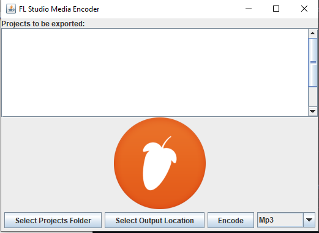
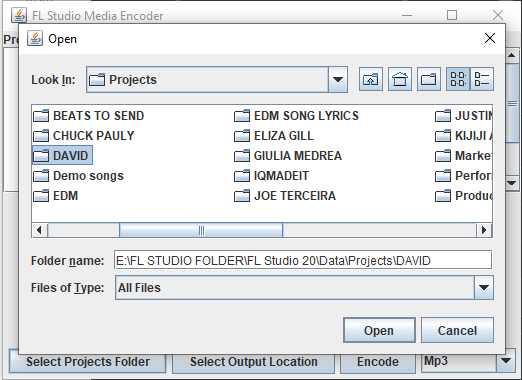

# FL-Studio-Media-Encoder
While running my professional home recording studio this year, I noticed that the DAW (digital audio workstation) 
I use does not come with a feature to batch export projects, much like Adobe Media Encoder functions. 
I realized this could save me a lot of time exporting client projects, so I created something akin to the Adobe counterpart in Java using Swing to create a functioning GUI. 
As well, I turned it into an executable (.exe) file using Launch4j, and as well I learned how to work with the Windows 10 Registry in Java.

To use this application, simply download the .exe file, select your project folder, select your output directory, and press "Encode". The application will automatically find your FL Studio install location.

##Images

